# 🌌 KnowledgeSphere AI

<div align="center">

**An AI-Powered Institutional Knowledge Management & Assessment Platform**

[](https://python.org)
[](https://flask.palletsprojects.com)
[](https://aistudio.google.com)
[](https://sqlite.org)
[](LICENSE)

*Centralizing institutional knowledge with NLP-powered search, multi-format document ingestion, and AI-driven quiz generation.*

</div>

---

## 📌 Project Overview

**KnowledgeSphere AI** is a full-stack web application designed to solve a real problem faced by academic institutions: **knowledge is scattered across PDFs, spreadsheets, PowerPoints, and Word documents** with no unified way to search, access, or learn from it.

The platform provides:
- **5-format document ingestion** with automatic AI text extraction
- **Hybrid semantic search** combining sentence embeddings and keyword matching
- **AI Quiz Generator** using Google Gemini LLM to convert stored knowledge into MCQ assessments with answer keys and explanations
- **Granular Role-Based Access Control (RBAC)** with four stakeholder tiers
- **Offline-resilient architecture** with deterministic fallback embeddings

Built as a production-quality portfolio project showcasing full-stack Python development, NLP integration, LLM API usage, and secure web application design.

---

## 🚀 Key Features

| Feature | Implementation | Technology |
|:--------|:--------------|:-----------|
| **Multi-Format File Support** | Extracts text from 5 file types | PyPDF2, python-docx, python-pptx, openpyxl |
| **Hybrid Semantic Search** | Dense vector + sparse keyword retrieval | SentenceTransformers, scikit-learn |
| **AI Quiz Generator** | LLM-driven MCQ generation from documents | Google Gemini (gemini-1.5-flash) |
| **Role-Based Access Control** | 4 roles, audience-level document visibility | Flask sessions, werkzeug.security |
| **Keyphrase Auto-Tagging** | Automatic metadata extraction | KeyBERT + fallback TF-IID |
| **Offline Resilience** | Hash-based deterministic embeddings | NumPy |
| **Audit Logging** | Traceable user activity logs | SQLite |
| **Sliding-Window Chunking** | Prevents context fragmentation | Custom tokenizer (180-word, 40-overlap) |

---

## 🎯 Feature Deep Dives

### 1. 📄 Multi-Format Document Ingestion

The platform ingests documents across **5 file formats**, each with a dedicated extraction pipeline:

```
┌─────────────────────────────────────────────────────────┐
│                File Upload Pipeline                       │
├──────────┬──────────────────────────────────────────────┤
│ .pdf     │ PyPDF2 — page-by-page text extraction        │
│ .docx    │ python-docx — paragraphs + table cell text   │
│ .pptx    │ python-pptx — slide-by-slide run extraction  │
│ .xlsx    │ openpyxl — sheet-by-sheet row concatenation  │
│ .txt     │ Native file I/O with UTF-8 / Latin-1 fallback│
└──────────┴──────────────────────────────────────────────┘
```

After extraction, all text is normalized into a unified corpus regardless of source format, enabling cross-format semantic search.

**Why this matters for real institutions:** Faculty PowerPoint slides, Excel research data, Word policy documents, and PDF textbooks can all coexist in the same searchable knowledge base.

---

### 2. 🔍 Hybrid Search Engine

The search engine uses a **two-stage scoring formula** that outperforms pure semantic or pure keyword search:

$$\text{Final Score} = 0.85 \times \text{Cosine Similarity}(\mathbf{q}, \mathbf{d}) + 0.15 \times \text{Keyword Overlap}(q, d)$$

**Stage 1 — Dense Retrieval (85% weight):**
- Document chunks and queries are encoded to 384-dimensional vectors using `all-MiniLM-L6-v2` (SentenceTransformers)
- Cosine similarity is computed between the query embedding and all stored chunk embeddings

**Stage 2 — Sparse Keyword Overlap (15% weight):**
$$\text{Keyword Overlap} = \frac{|\text{Query Terms} \cap \text{Document Keywords}|}{|\text{Query Terms}|}$$

**Offline Fallback:** If SentenceTransformers cannot load (no internet, no cache), the system falls back to a deterministic hash-based vectorizer — the app never crashes:

```python
def hashed_embedding(text, dim=384):
    vector = np.zeros(dim, dtype=np.float32)
    tokens = re.findall(r"[a-zA-Z0-9]{2,}", text.lower())
    for token in tokens:
        vector[hash(token) % dim] += 1.0
    norm = np.linalg.norm(vector)
    return vector / norm if norm > 0 else vector
```

---

### 3. 🤖 AI Quiz Generator

The most complex feature — a full pipeline that converts stored knowledge into assessable learning material:

```
Document Chunks → Context Assembly → Gemini LLM Prompt → JSON Parsing → Quiz Storage → Interactive Assessment
```

**Technical Implementation:**

1. **Content Retrieval** — Pulls all text chunks for the selected document from SQLite, ordered by chunk index
2. **Context Window Management** — Truncates combined text to 15,000 words to stay within LLM context limits
3. **Structured Prompt Engineering** — Uses a strict JSON-schema prompt to guarantee parseable output:

```python
prompt = f"""Generate exactly {num_questions} MCQs as a raw JSON array.
Each object: {{"question": str, "options": [4 strings], "answer": "A|B|C|D", "explanation": str}}
Source Text: {full_text}"""
```

4. **Robust Response Parsing** — Strips markdown code fences before JSON parsing
5. **Persistent Storage** — Saves generated quizzes to SQLite for replay without re-querying the LLM
6. **Interactive Grading** — Scores responses and returns per-question explanations with highlighted correct/incorrect answers
7. **Activity Logging** — Records quiz generation and completion with scores for audit trails

**Supported:** 3, 5, 10, and 15-question assessments. Configurable Gemini API key per request.

---

### 4. 🔐 Role-Based Access Control (RBAC)

Four stakeholder tiers with cascading document visibility:

```
Administrator ─── can see: all, students, faculty, researchers, administrators
     │
  Faculty   ─────── can see: all, students, faculty, researchers
     │
 Researcher ────── can see: all, researchers
     │
  Student   ─────── can see: all, students
```

**Upload permissions:** Only `faculty`, `administrator`, and `researcher` roles can ingest documents.

**Domain management:** Exclusively `administrator`.

All routes are protected by decorators:
```python
@roles_required("faculty", "administrator", "researcher")
def upload(): ...
```

---

## 🏗️ System Architecture

```mermaid
flowchart TD
    subgraph Ingestion["📥 Ingestion Pipeline"]
        UP[File Upload\n.pdf .docx .pptx .xlsx .txt]
        UP --> EX[Format-Specific\nText Extractor]
        EX --> CK[Sliding-Window Chunker\n180 words, 40 overlap]
        CK --> KB[KeyBERT Keyphrase\nExtractor]
        CK --> EMB[SentenceTransformer\nEncoder / Hash Fallback]
        KB  --> DB[(SQLite\ndatabase.db)]
        EMB --> DB
    end

    subgraph Search["🔍 Search Pipeline"]
        Q[User Query] --> QE[Query Encoder]
        QE --> CS[Cosine Similarity\nComputation]
        Q  --> KM[Keyword Overlap\nAnalyzer]
        CS --> HS[Hybrid Score\n0.85·Semantic + 0.15·Keyword]
        KM --> HS
        DB --> CS
        HS --> AF[Audience\nVisibility Filter]
        AF --> RR[Ranked Results\nDeduplicated Top-5]
    end

    subgraph Quiz["🤖 AI Quiz Pipeline"]
        DS[Select Document] --> CR[Chunk Retrieval\nfrom SQLite]
        CR --> GM[Gemini LLM\ngemini-1.5-flash]
        GM --> JP[JSON Parser\n+ Validation]
        JP --> QS[Quiz Storage\nSQLite]
        QS --> IA[Interactive\nAssessment]
        IA --> SC[Score + Explanations\n+ Audit Log]
    end

    style Ingestion fill:#0d2818,stroke:#39d353,stroke-width:2px
    style Search    fill:#0d1a2e,stroke:#58a6ff,stroke-width:2px
    style Quiz      fill:#1a0d2e,stroke:#bc8cff,stroke-width:2px
```



---

## 📂 Project Structure

```text
KnowledgeSphere AI/
├── app.py                      # Flask app — all routes, DB logic, NLP pipeline
├── database.db                 # SQLite database (auto-created on first run)
├── requirements.txt            # Python dependency manifest
├── .env                        # Environment variables (GEMINI_API_KEY)
├── uploads/                    # Uploaded documents stored here
├── static/
│   └── style.css               # Premium dark-mode design system (Inter + Space Grotesk)
└── templates/
    ├── index.html              # Login page with animated feature badges
    ├── register.html           # Account creation with role selection
    ├── dashboard.html          # Role-aware dashboard with stats + recent docs
    ├── upload.html             # Drag-and-drop multi-format upload console
    ├── search.html             # Semantic search with color-coded match scores
    ├── documents.html          # Domain-filtered document library
    ├── domains.html            # Admin-only domain category manager
    ├── quiz_generator.html     # AI quiz creation dashboard
    ├── quiz_view.html          # Interactive MCQ assessment page
    ├── quiz_results.html       # Detailed score + answer explanations
    ├── admin.html              # Admin redirect stub
    └── user.html               # User redirect stub
```

---

## 📊 Database Schema

### `users`
| Column | Type | Notes |
|:-------|:-----|:------|
| `id` | INTEGER PK | Auto-increment |
| `username` | TEXT UNIQUE | Login identifier |
| `password` | TEXT | Werkzeug pbkdf2/scrypt hash |
| `role` | TEXT | `student` \| `faculty` \| `administrator` \| `researcher` |

### `knowledge` (Document Chunks)
| Column | Type | Notes |
|:-------|:-----|:------|
| `id` | INTEGER PK | Auto-increment |
| `document` | TEXT | Original filename |
| `domain` | TEXT | Category (Academics, Research, etc.) |
| `text` | TEXT | 180-word sliding window chunk |
| `embedding` | TEXT | JSON-serialized 384-d float vector |
| `audience` | TEXT | `all` \| `students` \| `faculty` \| `researchers` \| `administrators` |
| `keywords` | TEXT | Comma-separated keyphrases |
| `uploaded_by` | TEXT | Uploader username |
| `created_at` | TEXT | ISO 8601 UTC timestamp |

### `quizzes`
| Column | Type | Notes |
|:-------|:-----|:------|
| `id` | INTEGER PK | Auto-increment |
| `document` | TEXT | Source document filename |
| `questions_json` | TEXT | JSON array: `[{question, options, answer, explanation}]` |
| `created_at` | TEXT | ISO 8601 UTC timestamp |

### `domains`
| Column | Type | Notes |
|:-------|:-----|:------|
| `id` | INTEGER PK | Auto-increment |
| `name` | TEXT UNIQUE | Domain category name |

### `activity_log`
| Column | Type | Notes |
|:-------|:-----|:------|
| `id` | INTEGER PK | Auto-increment |
| `username` | TEXT | Actor |
| `action` | TEXT | `login` \| `upload` \| `generate_quiz` \| `take_quiz` \| etc. |
| `details` | TEXT | Human-readable event description |
| `created_at` | TEXT | ISO 8601 UTC timestamp |

---

## ⚙️ Setup & Installation

### Prerequisites
- Python 3.8 or higher
- pip
- (Optional) A free [Google AI Studio](https://aistudio.google.com) API key for quiz generation

### 1. Clone the Repository

```bash
git clone https://github.com/<your-username>/KnowledgeSphere-AI.git
cd "KnowledgeSphere AI"
```

### 2. Create & Activate a Virtual Environment

```bash
# Windows
python -m venv venv
venv\Scripts\activate

# macOS / Linux
python3 -m venv venv
source venv/bin/activate
```

### 3. Install Dependencies

```bash
pip install -r requirements.txt
```

> [!NOTE]
> First launch downloads the `all-MiniLM-L6-v2` SentenceTransformer model (~90 MB) to your local HuggingFace cache. This is a one-time download. The app works offline after that using the cached model.

### 4. Configure Environment Variables

Create a `.env` file in the project root:

```env
# .env
GEMINI_API_KEY=your_gemini_api_key_here
```

> [!TIP]
> Get a free Gemini API key at [aistudio.google.com](https://aistudio.google.com). The Quiz Generator also accepts per-request keys in the UI if no environment variable is set.

### 5. Run the Application

```bash
python app.py
```

Open [http://127.0.0.1:5000](http://127.0.0.1:5000) in your browser.

> [!NOTE]
> The database schema is created automatically on first run. Default domains — *Academics*, *Administration*, *Research*, and *General* — are seeded on startup.

---

## 🔌 API & Route Reference

| Endpoint | Method | Role Required | Description |
|:---------|:-------|:--------------|:------------|
| `/` | GET | Public | Login page |
| `/register` | GET, POST | Public | Account creation |
| `/login` | POST | Public | Authentication |
| `/logout` | GET | Session | Sign out + audit log |
| `/dashboard` | GET | Any | Role-aware home dashboard |
| `/upload` | GET, POST | Faculty / Admin / Researcher | Multi-format document ingestion |
| `/search` | GET, POST | Any | Hybrid semantic search |
| `/documents` | GET | Any | Domain-filtered document library |
| `/domains` | GET, POST | Administrator | Domain category management |
| `/preview/<filename>` | GET | Any (visibility check) | Inline document preview |
| `/download/<filename>` | GET | Any (visibility check) | File download with attachment header |
| `/quiz` | GET | Any | Quiz generator dashboard |
| `/quiz/generate` | POST | Any | Gemini LLM quiz generation |
| `/quiz/view/<quiz_id>` | GET | Any (visibility check) | Interactive MCQ assessment |
| `/quiz/submit/<quiz_id>` | POST | Any (visibility check) | Grade answers + return results |

---

## 🧠 Technical Decisions & Tradeoffs

### Why SQLite over PostgreSQL?
SQLite provides zero-config setup ideal for a portfolio deployment. Embeddings stored as JSON blobs trade query performance for portability — a production version would use `pgvector` or `FAISS` for ANN search over millions of vectors.

### Why Sliding-Window Chunking over Sentence Splitting?
Fixed-width word chunks with 40-word overlap guarantee consistent embedding dimensions and prevent semantic loss at chunk boundaries. The overlap ensures that concepts spanning chunk boundaries are captured in at least one chunk.

### Why Hybrid Search instead of pure vector search?
Pure semantic search struggles with exact terminology (e.g., specific course codes, acronyms). The 85/15 weighted blend ensures semantically similar documents rank first while exact keyword matches receive a boost.

### Why Google Gemini for Quiz Generation?
Gemini's structured output compliance and large context window (1M tokens) make it ideal for ingesting long document text and producing schema-strict JSON MCQs. The `gemini-1.5-flash` model balances speed and accuracy for educational content generation.

---

## 🔐 Security Considerations

- **Passwords** hashed with Werkzeug's `generate_password_hash` (pbkdf2-sha256 or scrypt)
- **Legacy plaintext passwords** detected by absence of colon separator and migrated to hashed format on login
- **File uploads** validated by extension whitelist (`pdf`, `docx`, `pptx`, `xlsx`, `txt`)
- **Route access control** enforced by `@login_required` and `@roles_required` decorators
- **Document visibility** enforced at query time by audience-aware SQL WHERE clauses — not just at the UI layer
- **Session management** using Flask's signed cookie sessions with a server-side secret key
- **API keys** never stored in the database; accepted as per-request POST parameters only

---

## 📈 Potential Improvements (Roadmap)

| Enhancement | Impact | Effort |
|:-----------|:-------|:-------|
| Replace JSON embeddings with FAISS index | 10–100× faster search at scale | Medium |
| Add streaming quiz generation (SSE) | Better UX for slow connections | Low |
| OCR support for scanned PDFs | Expands coverage to legacy documents | Medium |
| Quiz attempt history & analytics dashboard | Learning progress tracking | Medium |
| Multi-language document support | International institutions | High |
| REST API + JWT authentication | Enables mobile/third-party integration | High |
| Docker containerization | One-command deployment | Low |
| PostgreSQL + pgvector migration | Production-grade vector search | Medium |

---

## 🤝 Contributing

1. Fork the repository
2. Create a feature branch: `git checkout -b feature/YourFeature`
3. Commit with conventional commits: `git commit -m "feat: add YourFeature"`
4. Push: `git push origin feature/YourFeature`
5. Open a Pull Request with a clear description of the change

---

## 📄 License

This project is licensed under the **MIT License**. See [LICENSE](LICENSE) for details.

---

<div align="center">

**Built with Python, Flask, SentenceTransformers, KeyBERT & Google Gemini**

*Designed for institutional knowledge management — tested, documented, interview-ready.*

</div>
