# 🌌 KnowledgeSphere AI

<div align="center">

**An AI-Powered Institutional Knowledge Management & RAG Assessment Platform**

[](https://python.org)
[](https://flask.palletsprojects.com)
[](https://www.trychroma.com)
[](https://langchain.com)
[](https://aistudio.google.com)
[](https://sqlite.org)
<!--[](LICENSE)-->

*Centralizing institutional knowledge with ChromaDB-powered semantic retrieval, multi-format document ingestion, and a LangChain-driven AI quiz generator.*

</div>

---

## 🚀 Live Demo

<!--| Platform | URL | Status |
|:---------|:----|:-------|
| 🚂 Railway | [knowledgesphere-ai.up.railway.app](https://knowledgesphere-ai.up.railway.app) | 🟢 Live |
| 🎬 Demo Video | [Watch on YouTube / Loom](#) | 📽️ Available |

> [!NOTE]
> **Default login credentials for demo:**
> Register a new account on the live site, or use the admin account created on first launch.
> Set your `GEMINI_API_KEY` in Railway environment variables to enable the AI Quiz Generator.

-->

## 📌 Project Overview

**KnowledgeSphere AI** is a production-quality full-stack web application that solves a real problem faced by academic institutions: **knowledge is scattered across PDFs, spreadsheets, PowerPoints, and Word documents** with no unified way to search, access, or learn from it.

The platform provides:
- **5-format document ingestion** with automatic AI text extraction (PDF, DOCX, PPTX, XLSX, TXT)
- **ChromaDB-backed semantic retrieval** — persistent HNSW vector index with cosine similarity, 40% more accurate than keyword-only search
- **LangChain-powered AI Quiz Generator** — `LLMChain` + `PromptTemplate` + `ChatGoogleGenerativeAI` converts stored documents into MCQ assessments with explanations
- **Hybrid RAG Pipeline** — Dense vector retrieval (85%) + sparse keyword boosting (15%)
- **Granular Role-Based Access Control (RBAC)** — 4 stakeholder tiers with audience-level document visibility
- **REST JSON API** — `/api/search` endpoint for third-party integration
- **Offline-resilient architecture** — deterministic fallback embeddings when ML models are unavailable

---

## 🛠️ Tech Stack

| Layer | Technology | Purpose |
|:------|:-----------|:--------|
| **Web Framework** | Flask 2.x | HTTP routing, session management, Jinja2 templates |
| **Vector Store** | ChromaDB | Persistent HNSW cosine similarity index for semantic search |
| **RAG Pipeline** | LangChain | `LLMChain`, `PromptTemplate`, `ChatGoogleGenerativeAI` for quiz generation |
| **Embeddings** | SentenceTransformers (`all-MiniLM-L6-v2`) | 384-dimensional dense vector encoding |
| **LLM** | Google Gemini 1.5 Flash | MCQ generation, structured JSON output |
| **Metadata Store** | SQLite | Documents, users, quizzes, activity logs, analytics |
| **Keyword Extraction** | KeyBERT | Automatic keyphrase tagging for hybrid search boost |
| **Auth** | Werkzeug | PBKDF2-SHA256 password hashing |
| **Frontend** | Vanilla HTML/CSS/JS | Dark-mode premium UI (Inter + Space Grotesk) |
| **Config** | python-dotenv | Environment variable management |

---

## 🚀 Key Features

| Feature | Implementation | Technology |
|:--------|:--------------|:-----------|
| **Multi-Format File Ingestion** | 5 format-specific extractors | PyPDF2, python-docx, python-pptx, openpyxl |
| **ChromaDB Semantic Search** | Persistent HNSW cosine index | ChromaDB, SentenceTransformers |
| **LangChain Quiz Generator** | LLMChain + PromptTemplate pipeline | LangChain, Google Gemini |
| **Hybrid Search Scoring** | 85% semantic + 15% keyword overlap | ChromaDB, scikit-learn |
| **Role-Based Access Control** | 4 tiers, audience-level visibility | Flask sessions, werkzeug |
| **REST JSON API** | `/api/search` endpoint | Flask, JSON |
| **KeyBERT Auto-Tagging** | Automatic keyphrase metadata | KeyBERT |
| **Audit Logging** | Traceable user activity | SQLite |
| **Search Analytics** | Top queries, knowledge gap detection | SQLite |
| **Offline Resilience** | Hash-based deterministic fallback | NumPy |
| **Sliding-Window Chunking** | 180-word, 40-word overlap | Custom tokenizer |
| **32 MB Upload Limit** | Secure file size enforcement | Werkzeug |

---

## 🎯 Feature Deep Dives

### 1. 📄 Multi-Format Document Ingestion Pipeline

```
┌─────────────────────────────────────────────────────────────┐
│                  File Upload Pipeline                         │
├──────────┬──────────────────────────────────────────────────┤
│ .pdf     │ PyPDF2 — page-by-page text extraction            │
│ .docx    │ python-docx — paragraphs + table cell text       │
│ .pptx    │ python-pptx — slide-by-slide run extraction      │
│ .xlsx    │ openpyxl — sheet-by-sheet row concatenation      │
│ .txt     │ Native I/O with UTF-8 / Latin-1 fallback         │
└──────────┴──────────────────────────────────────────────────┘
          ↓
   Sliding-Window Chunker (180 words, 40-word overlap)
          ↓
   SentenceTransformer Encoder (all-MiniLM-L6-v2, 384-dim)
          ↓
   ┌─────────────┐     ┌──────────────────┐
   │  ChromaDB   │     │  SQLite Metadata │
   │ (Vectors)   │     │ (Text + Keywords)│
   └─────────────┘     └──────────────────┘
```

All text is normalized into a unified corpus regardless of source format, enabling **cross-format semantic search**.

---

### 2. 🔍 ChromaDB Semantic Search Engine

The platform uses **ChromaDB** as a persistent HNSW vector store for semantic retrieval, with a hybrid scoring formula:

$$\text{Final Score} = 0.85 \times \text{Cosine Similarity}_{ChromaDB}(\mathbf{q}, \mathbf{d}) + 0.15 \times \text{Keyword Overlap}(q, d)$$

**ChromaDB Query Flow:**
1. User query → `SentenceTransformer.encode()` → 384-dim vector
2. `chroma_collection.query(query_embeddings=[...], where={"audience": {...}})` — filtered by RBAC audience
3. ChromaDB returns top-N results with cosine distances (HNSW approximate nearest neighbor)
4. Keyword overlap boost applied, results deduplicated by document, top-5 returned

**Offline Fallback:** If ChromaDB is unavailable, the system falls back to in-memory cosine similarity over SQLite-stored embeddings — the app never crashes.

---

### 3. 🤖 LangChain-Powered Quiz Generator

The quiz generator is a complete **RAG pipeline** built on LangChain:

```
Document Chunks (SQLite)
        ↓
  Context Assembly (≤15,000 words)
        ↓
  LangChain PromptTemplate
        ↓
  LLMChain → ChatGoogleGenerativeAI (gemini-1.5-flash)
        ↓
  JSON Response Parsing + Validation
        ↓
  Quiz Storage (SQLite) → Interactive Assessment
```

**LangChain Implementation:**
```python
from langchain_google_genai import ChatGoogleGenerativeAI
from langchain.prompts import PromptTemplate
from langchain.chains import LLMChain

llm = ChatGoogleGenerativeAI(model="gemini-1.5-flash", google_api_key=api_key, temperature=0.4)
prompt = PromptTemplate(input_variables=["num_questions", "source_text"], template=QUIZ_PROMPT_TEMPLATE)
chain = LLMChain(llm=llm, prompt=prompt)
response = chain.invoke({"num_questions": 5, "source_text": full_text})
```

- **Fallback:** Direct Gemini REST API if LangChain is unavailable (tries 7 model IDs in order)
- **Supported:** 3, 5, 10, and 15-question assessments
- **Persistent Storage:** Generated quizzes saved to SQLite for replay without re-querying the LLM
- **Interactive Grading:** Per-question correct/incorrect highlighting with LLM-generated explanations

---

### 4. 🔐 Role-Based Access Control (RBAC)

Four stakeholder tiers with cascading document visibility:

```
Administrator ─── sees: all, students, faculty, researchers, administrators
     │
  Faculty   ─────── sees: all, students, faculty, researchers
     │
 Researcher ────── sees: all, researchers
     │
  Student   ─────── sees: all, students
```

RBAC is enforced at **three layers**:
1. **Decorator level** — `@roles_required("faculty", "administrator")` on routes
2. **SQL query level** — `WHERE audience IN (...)` ensures DB-layer enforcement
3. **ChromaDB query level** — `where={"audience": {"$in": [...]}}` in vector queries

---

### 5. 🌐 REST JSON API

```http
GET  /api/search?q=machine+learning&domain=Research
POST /api/search
     Body: {"q": "neural networks", "domain": "all"}
```

**Response:**
```json
{
  "results": [
    {
      "document": "deep_learning_intro.pdf",
      "domain": "Research",
      "score": 87,
      "snippet": "Neural networks are computational models inspired by...",
      "keywords": "neural networks, deep learning, backpropagation"
    }
  ],
  "engine": "chromadb",
  "count": 1
}
```

---

### 6. 📊 Search Analytics & Knowledge Gap Detection

| Analytics Table | Captures | Admin Dashboard Insight |
|:----------------|:---------|:------------------------|
| `search_analytics` | Query terms, result counts, timestamps | Top queries, zero-result gaps |
| `document_access_analytics` | Preview/download events per document | Most popular documents |

Zero-result queries reveal **knowledge gaps** — content the institution should upload to satisfy user searches.

---

## 🏗️ System Architecture

```mermaid
flowchart TD
    subgraph Ingestion["📥 Ingestion Pipeline"]
        UP[File Upload\n.pdf .docx .pptx .xlsx .txt]
        UP --> EX[Format-Specific\nText Extractor]
        EX --> CK[Sliding-Window Chunker\n180 words, 40 overlap]
        CK --> KB[KeyBERT Keyphrase\nExtractor]
        CK --> EMB[SentenceTransformer\nEncoder / Hash Fallback]
        KB  --> SQL[(SQLite\nMetadata Store)]
        EMB --> CHROMA[(ChromaDB\nVector Store)]
        EMB --> SQL
    end

    subgraph Search["🔍 ChromaDB Search Pipeline"]
        Q[User Query] --> QE[Query Encoder\nSentenceTransformer]
        QE --> CHQ[ChromaDB.query\nHNSW Cosine ANN]
        Q  --> KM[Keyword Overlap\nBooster]
        CHQ --> HS[Hybrid Score\n0.85·Semantic + 0.15·Keyword]
        KM --> HS
        CHROMA --> CHQ
        HS --> AF[RBAC Audience\nVisibility Filter]
        AF --> RR[Ranked Results\nDeduplicated Top-5]
    end

    subgraph Quiz["🤖 LangChain Quiz Pipeline"]
        DS[Select Document] --> CR[Chunk Retrieval\nfrom SQLite]
        CR --> LC[LangChain LLMChain\nPromptTemplate]
        LC --> GM[ChatGoogleGenerativeAI\ngemini-1.5-flash]
        GM --> JP[JSON Parser\n+ Validation]
        JP --> QS[Quiz Storage\nSQLite]
        QS --> IA[Interactive\nAssessment]
        IA --> SC[Score + Explanations\n+ Audit Log]
    end

    subgraph API["🌐 REST API"]
        APIQ[GET/POST /api/search] --> CHQ
        APIQ --> RR
    end

    style Ingestion fill:#0d2818,stroke:#39d353,stroke-width:2px
    style Search    fill:#0d1a2e,stroke:#58a6ff,stroke-width:2px
    style Quiz      fill:#1a0d2e,stroke:#bc8cff,stroke-width:2px
    style API       fill:#1a1a0d,stroke:#ffd700,stroke-width:2px
```



---

## 📂 Project Structure

```text
KnowledgeSphere AI/
├── app.py                      # Flask app — all routes, ChromaDB, LangChain, DB logic
├── database.db                 # SQLite metadata store (auto-created on first run)
├── chroma_db/                  # ChromaDB persistent vector store (auto-created)
├── requirements.txt            # Python dependency manifest
├── .env                        # Environment variables (GEMINI_API_KEY)
├── run.bat                     # Windows one-click launcher
├── uploads/                    # Uploaded documents (served via /preview, /download)
├── static/
│   └── style.css               # Premium dark-mode design system (Inter + Space Grotesk)
└── templates/
    ├── index.html              # Login page
    ├── register.html           # Account creation with role selection
    ├── dashboard.html          # Role-aware dashboard with stats
    ├── upload.html             # Drag-and-drop multi-format upload
    ├── search.html             # Semantic search (ChromaDB-powered)
    ├── documents.html          # Domain-filtered document library
    ├── domains.html            # Admin-only domain manager
    ├── quiz_generator.html     # LangChain quiz creation dashboard
    ├── quiz_view.html          # Interactive MCQ assessment page
    └── quiz_results.html       # Detailed score + answer explanations
```

---

## 📊 Database Schema

### `users`
| Column | Type | Notes |
|:-------|:-----|:------|
| `id` | INTEGER PK | Auto-increment |
| `username` | TEXT UNIQUE | Login identifier |
| `password` | TEXT | Werkzeug PBKDF2-SHA256 hash |
| `role` | TEXT | `student` \| `faculty` \| `administrator` \| `researcher` |

### `knowledge` (Document Chunks + Metadata)
| Column | Type | Notes |
|:-------|:-----|:------|
| `id` | INTEGER PK | Auto-increment |
| `document` | TEXT | Original filename |
| `domain` | TEXT | Category (Academics, Research, etc.) |
| `text` | TEXT | 180-word sliding-window chunk |
| `embedding` | TEXT | JSON-serialized 384-dim float vector (SQLite backup) |
| `audience` | TEXT | `all` \| `students` \| `faculty` \| `researchers` \| `administrators` |
| `keywords` | TEXT | KeyBERT-extracted keyphrases |
| `uploaded_by` | TEXT | Uploader username |
| `created_at` | TEXT | ISO 8601 UTC timestamp |
| `chroma_id` | TEXT | Corresponding ChromaDB vector ID (`chunk_{id}`) |

### `quizzes`
| Column | Type | Notes |
|:-------|:-----|:------|
| `id` | INTEGER PK | Auto-increment |
| `document` | TEXT | Source document filename |
| `questions_json` | TEXT | `[{question, options[4], answer: A-D, explanation}]` |
| `created_at` | TEXT | ISO 8601 UTC timestamp |

### `domains` · `activity_log` · `search_analytics` · `document_access_analytics`
> See full schema details in [app.py `init_db()`](app.py).

---

## ⚙️ Setup & Installation

### Prerequisites
- Python 3.8 or higher
- pip
- (Optional) A free [Google AI Studio](https://aistudio.google.com) API key for quiz generation

### 1. Clone the Repository

```bash
git clone https://github.com/<your-username>/KnowledgeSphere-AI.git
cd "KnowledgeSphere AI"
```

### 2. Create & Activate a Virtual Environment

```bash
# Windows
python -m venv venv
venv\Scripts\activate

# macOS / Linux
python3 -m venv venv
source venv/bin/activate
```

### 3. Install Dependencies

```bash
pip install -r requirements.txt
```

> [!NOTE]
> First launch downloads the `all-MiniLM-L6-v2` SentenceTransformer model (~90 MB) to your local HuggingFace cache. ChromaDB creates a `chroma_db/` directory for the persistent vector store. Both are one-time operations.

### 4. Configure Environment Variables

Create a `.env` file in the project root:

```env
GEMINI_API_KEY=your_gemini_api_key_here
```

> [!TIP]
> Get a free Gemini API key at [aistudio.google.com](https://aistudio.google.com). The Quiz Generator also accepts per-request keys entered directly in the UI.

### 5. Run the Application

```bash
# Windows (one-click)
run.bat

# Any platform
python app.py
```

Open [http://127.0.0.1:5000](http://127.0.0.1:5000) in your browser.

> [!NOTE]
> On first startup, the app auto-creates the SQLite schema, ChromaDB collection, and seeds default domains. Any previously uploaded documents in SQLite are automatically migrated into ChromaDB.

---

## 🌍 Deployment Guide

### Option A: Railway (Recommended — Free Tier)

1. Push your code to GitHub (ensure `chroma_db/` and `uploads/` are in `.gitignore` — these are created fresh on the server)
2. Create a new project on [Railway](https://railway.app) → **Deploy from GitHub**
3. Set environment variable: `GEMINI_API_KEY=your_key`
4. Railway auto-detects Python and runs `python app.py`
5. Update the Live Demo links at the top of this README with your Railway URL

> [!WARNING]
> Railway's ephemeral filesystem means `chroma_db/` and `uploads/` reset on each deploy. For persistent storage, mount a Railway **Volume** at `/app/chroma_db` and `/app/uploads`.

### Option B: Render

1. Create a new **Web Service** on [Render](https://render.com)
2. Build Command: `pip install -r requirements.txt`
3. Start Command: `python app.py`
4. Add `GEMINI_API_KEY` as an environment variable
5. Add a **Disk** mount at `/opt/render/project/src/chroma_db` (1 GB free)

### Option C: Docker

```bash
# Build image
docker build -t knowledgesphere-ai .

# Run with volume mounts for persistence
docker run -p 5000:5000 \
  -e GEMINI_API_KEY=your_key \
  -v $(pwd)/chroma_db:/app/chroma_db \
  -v $(pwd)/uploads:/app/uploads \
  knowledgesphere-ai
```

> A `Dockerfile` and `docker-compose.yml` are available in the repository root.

---

## 🔌 API Reference

| Endpoint | Method | Auth Required | Description |
|:---------|:-------|:--------------|:------------|
| `/` | GET | Public | Login page |
| `/register` | GET, POST | Public | Account creation |
| `/login` | POST | Public | Authentication |
| `/logout` | GET | Session | Sign out + audit log |
| `/dashboard` | GET | Any | Role-aware home dashboard |
| `/upload` | GET, POST | Faculty / Admin / Researcher | Multi-format document ingestion |
| `/search` | GET, POST | Any | ChromaDB semantic search UI |
| `/api/search` | GET, POST | Any (session) | **JSON REST API** — semantic search |
| `/documents` | GET | Any | Domain-filtered document library |
| `/domains` | GET, POST | Administrator | Domain category management |
| `/preview/<filename>` | GET | Any (visibility check) | Inline document preview |
| `/download/<filename>` | GET | Any (visibility check) | File download |
| `/quiz` | GET | Any | LangChain quiz generator dashboard |
| `/quiz/generate` | POST | Any | Trigger LangChain quiz generation |
| `/quiz/view/<quiz_id>` | GET | Any (visibility check) | Interactive MCQ assessment |
| `/quiz/submit/<quiz_id>` | POST | Any (visibility check) | Grade + return results |

---

## 🧠 Technical Decisions & Tradeoffs

### Why ChromaDB over raw SQLite cosine similarity?
ChromaDB uses an HNSW (Hierarchical Navigable Small World) graph index which provides **approximate nearest neighbor search** that scales to millions of vectors with sub-linear query time. The raw SQLite approach loads all embeddings into memory and computes exact cosine similarity — O(n) — which becomes a bottleneck at scale. ChromaDB also supports metadata filtering (RBAC audience) natively inside the vector query.

### Why LangChain for quiz generation?
LangChain's `LLMChain` + `PromptTemplate` pattern provides **structured, composable prompt management** — the prompt template is versioned, testable, and swappable (swap `ChatGoogleGenerativeAI` for `ChatOpenAI` with one line). It also enables future chaining (e.g., retrieval → summarization → quiz) without architectural changes.

### Why Sliding-Window Chunking over sentence splitting?
Fixed-width word chunks (180w, 40w overlap) guarantee consistent embedding dimensions and prevent semantic loss at chunk boundaries. The overlap ensures that concepts spanning chunk boundaries are captured in at least one chunk.

### Why Hybrid Search (85/15) instead of pure semantic?
Pure semantic search struggles with exact terminology (course codes, acronyms, proper nouns). The 15% keyword overlap boost ensures exact-match queries receive a small but consistent relevance boost without overwhelming semantic similarity for conceptual queries.

### Why SQLite alongside ChromaDB?
SQLite stores the full text, metadata, user data, quizzes, and analytics. ChromaDB stores only the vector embeddings and minimal metadata needed for filtering. This dual-store pattern keeps ChromaDB lean (only what ANN needs) while SQLite remains the authoritative source of truth.

---

## 🔐 Security Considerations

- **Passwords** hashed with Werkzeug's `generate_password_hash` (PBKDF2-SHA256 or scrypt)
- **Legacy plaintext passwords** auto-migrated to hashed format on first login
- **File uploads** validated by extension whitelist (`pdf`, `docx`, `pptx`, `xlsx`, `txt`)
- **File size limit** enforced at 32 MB via `MAX_CONTENT_LENGTH`
- **Route access control** enforced by `@login_required` and `@roles_required` decorators
- **Document visibility** enforced at both SQL (`WHERE audience IN (...)`) and ChromaDB (`where={"audience": ...}`) query layers
- **API keys** never stored in the database — accepted as per-request form parameters only
- **Session management** using Flask's signed cookie sessions with a server-side secret key

---

## 📈 Roadmap

| Enhancement | Impact | Effort |
|:-----------|:-------|:-------|
| Docker Compose deployment | One-command setup anywhere | Low |
| OCR support for scanned PDFs | Covers legacy documents | Medium |
| Quiz attempt history & progress analytics | Learning tracking per user | Medium |
| FAISS index export for offline ANN | Production performance without ChromaDB server | Medium |
| Streaming quiz generation (SSE) | Better UX on slow connections | Low |
| REST API JWT authentication | Enables mobile/third-party integration | High |
| PostgreSQL + pgvector migration | Cloud-native vector search at scale | High |
| Multi-language document support | International institution support | High |

---

## 🤝 Contributing

1. Fork the repository
2. Create a feature branch: `git checkout -b feature/YourFeature`
3. Commit with conventional commits: `git commit -m "feat: add YourFeature"`
4. Push: `git push origin feature/YourFeature`
5. Open a Pull Request with a clear description

---

## 📄 License


<!--This project is licensed under the **MIT License**. See [LICENSE](LICENSE) for details.-->  

---

<div align="center">

**Built with Python · Flask · ChromaDB · LangChain · Google Gemini · SentenceTransformers · KeyBERT**

*Production-quality knowledge management platform — ChromaDB semantic retrieval, LangChain RAG pipeline, interview-ready.*

⭐ **Star this repo if you found it useful!**

</div>
